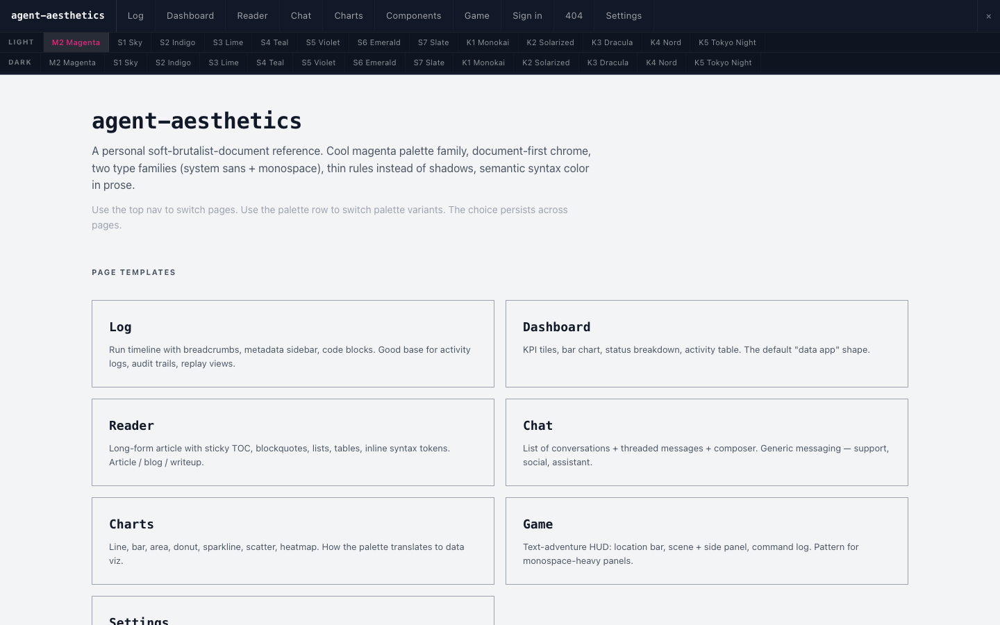
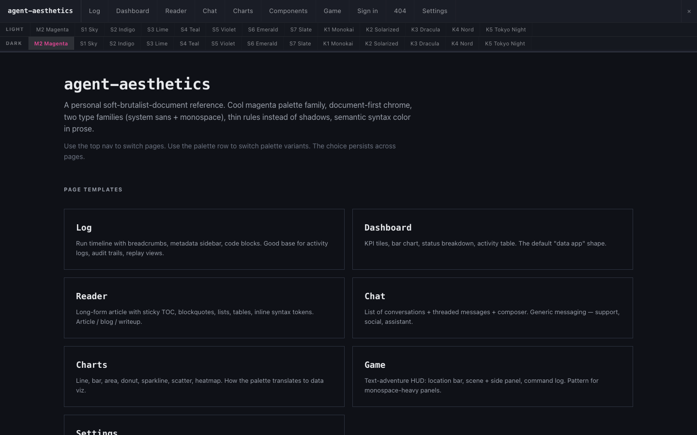
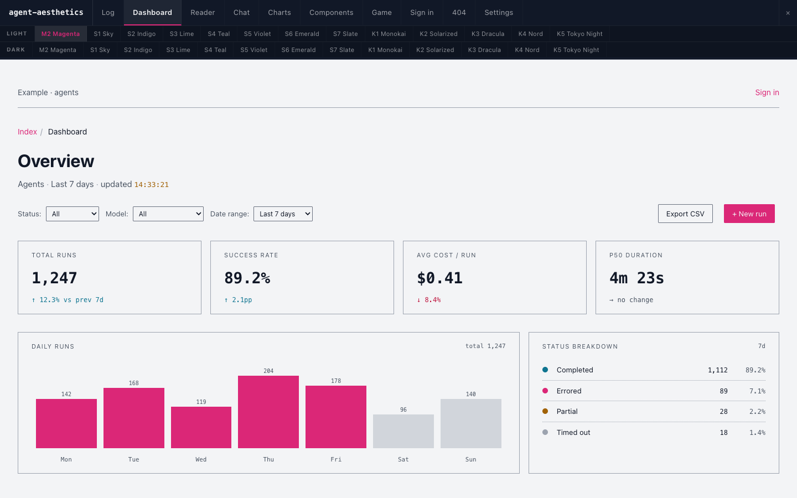
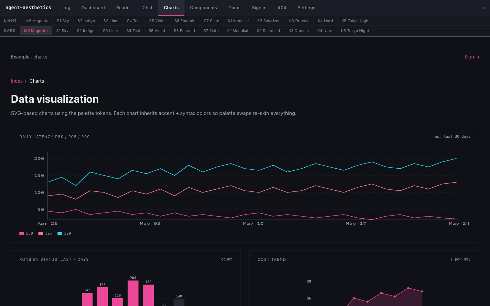
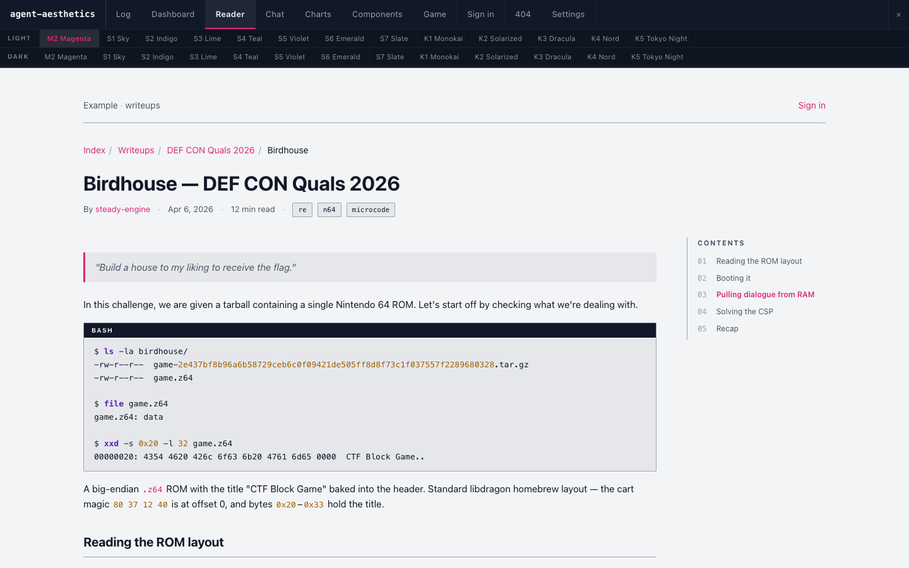
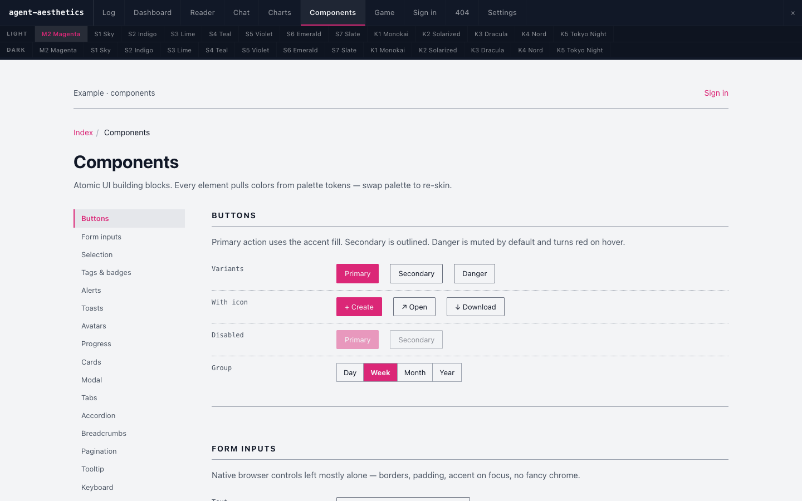
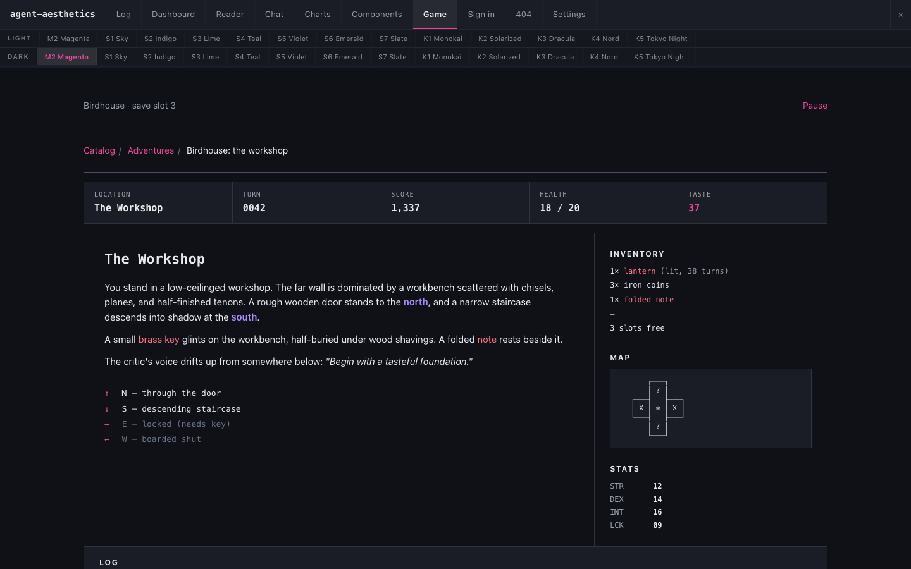
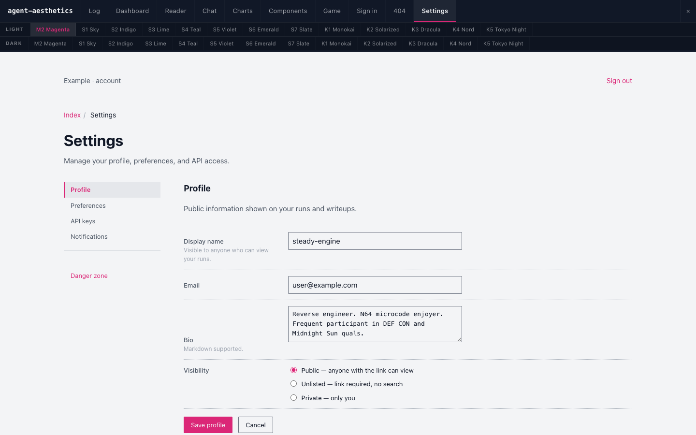

# agent-aesthetics

A personal design kit for projects vibe-coded with LLM agents.
Provides one specific aesthetic — "soft-brutalist-document" — so
generated UIs converge on a signature look instead of looking ad-hoc.

**Live preview:** <https://nnamon.github.io/agent-aesthetics/>



## Showcase

Same kit, eight pages, two palettes (M2 light + M2 dark). The
geometry — typography, spacing, rules, density — is identical across
all 26 palettes; only the color tokens swap.

<table>
  <tr>
    <td width="50%"></td>
    <td width="50%"></td>
  </tr>
  <tr>
    <td><sub>Hub · M2 Magenta light</sub></td>
    <td><sub>Hub · M2 Magenta dark</sub></td>
  </tr>
  <tr>
    <td></td>
    <td></td>
  </tr>
  <tr>
    <td><sub>Dashboard · KPI tiles, status breakdown, activity table</sub></td>
    <td><sub>Charts · SVG line/bar/area/donut/sparkline/scatter (dark)</sub></td>
  </tr>
  <tr>
    <td></td>
    <td></td>
  </tr>
  <tr>
    <td><sub>Reader · long-form article + sticky TOC + inline syntax tokens</sub></td>
    <td><sub>Components · atomic catalog with sticky section nav</sub></td>
  </tr>
  <tr>
    <td></td>
    <td></td>
  </tr>
  <tr>
    <td><sub>Game · text-adventure HUD pattern (dark)</sub></td>
    <td><sub>Settings · section nav, fields, toggles, danger zone</sub></td>
  </tr>
</table>

## What's in here

```
agent-aesthetics/
├── AESTHETIC.md           # Canonical spec — read this first.
├── README.md              # You're here.
├── prompts/
│   └── CLAUDE.md          # Agent-facing instructions for using the kit.
├── tokens/                # Machine-readable design tokens.
│   ├── palettes.json      # All palettes (M2 primary + S/K variants).
│   ├── typography.json    # Type families, scale, inline-mono semantics.
│   └── spacing.json       # Spacing scale, page padding, radii.
├── screenshots/           # Showcase images used by this README.
└── references/
    └── web/               # Eleven reference HTML pages, the show-don't-tell.
        ├── _starter.html  # ← COPY THIS for a new project (no scaffolding).
        ├── index.html     # Hub: visual landing card grid.
        ├── log.html       # Run timeline + sidebar + code blocks.
        ├── dashboard.html # KPI tiles, charts, status, activity table.
        ├── reader.html    # Long-form article + TOC + tables.
        ├── chat.html      # List + threaded messages + composer.
        ├── charts.html    # Line/bar/area/donut/sparkline/scatter/heatmap.
        ├── components.html# Every atomic component with variants.
        ├── game.html      # Text-adventure HUD pattern.
        ├── settings.html  # Section nav + fields + toggles + danger zone.
        ├── signin.html    # Centered auth card.
        ├── notfound.html  # 404 + empty-state patterns.
        └── assets/
            ├── theme.css  # ← THE KIT. M2 light+dark + components. Ship this.
            ├── styles.css # Reference site only: @imports theme.css, then
            │              #   adds the 24 extra palettes + topbar. Don't ship.
            └── reference.js # Reference-site harness (topbar/switcher). Don't ship.
```

## Preview

### Locally

The reference pages are static HTML — any static server works:

```sh
python3 -m http.server 8765
# visit http://localhost:8765/references/web/
```

### Deploy to GitHub Pages

A workflow at `.github/workflows/pages.yml` deploys `references/web/`
as the Pages site root on every push to `main`. To enable:

1. Push the repo to GitHub.
2. In the repo **Settings → Pages → Source**, select **GitHub Actions**.
3. Wait for the first workflow run to finish.
4. Site appears at `https://<user>.github.io/<repo-name>/` — `/index.html`
   is the hub, `/log.html`, `/charts.html`, etc. are the reference pages.

The topbar lets you flip palette (light row, dark row) and page
(top tabs). Choice persists in `localStorage`. Esc or the `×` button
hides the topbar entirely so you can see the aesthetic without chrome
competing for attention.

## Primary palette

**M2 Magenta** is the canonical palette. Light is the default; dark
(M2D) is auto-selected when the system reports
`prefers-color-scheme: dark`. Other palettes (S1–S7 cool variants,
K1–K5 well-known editor schemes) exist for comparison and special
projects but should default to M2.

## Using this kit on a new project

Read `AESTHETIC.md` for the principles and `prompts/CLAUDE.md` for the
agent workflow. The TL;DR:

1. Start from `references/web/_starter.html` — the clean minimal page.
2. Copy **only** `references/web/assets/theme.css` — one self-contained
   file. Each page: `<link rel="stylesheet" href="assets/theme.css">` and
   content inside `<div class="page">`. No body class, no JS: it's M2 light
   by default and auto-dark via `prefers-color-scheme` (pin with
   `<html data-theme="dark">`).
3. Copy component markup from `references/web/components.html`.
4. **Don't** copy `styles.css`, `reference.js`, or the topbar / palette
   switcher — those power the reference site only. Don't add new colors,
   shadows, gradients, decorative icons, or rounded corners > 4px.

## Status

Personal kit, evolving. Not designed for general consumption — choices
are made for one person's taste, not for flexibility.
